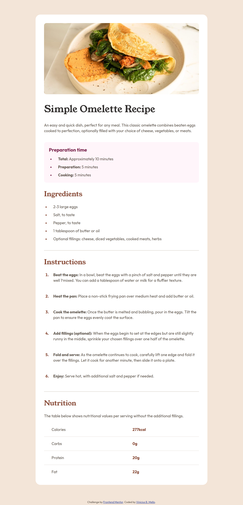

# Frontend Mentor - Recipe page solution

This is a solution to the [Recipe page challenge on Frontend Mentor](https://www.frontendmentor.io/challenges/recipe-page-KiTsR8QQKm). Frontend Mentor challenges help you improve your coding skills by building realistic projects.

## Table of contents

- [Overview](#overview)
  - [The challenge](#the-challenge)
  - [Screenshot](#screenshot)
  - [Links](#links)
- [My process](#my-process)
  - [Built with](#built-with)
  - [What I learned](#what-i-learned)
  - [Continued development](#continued-development)
- [Author](#author)

## Overview

### Screenshot

### Links

- Solution URL: [gitHub](https://your-solution-url.com)
- Live Site URL: [live site](https://vinimello90.github.io/recipe_page_challenge/)

## My process

### Built with

- Semantic HTML5 markup
- BEM methodology
- CSS custom properties
- Flexbox

### What I learned

I improved my semantic HTML and CSS skills to properly work with lists and tables.

## Author

- Website - [Vinicius B. Mello](#)
- Frontend Mentor - [@Vinimello90](https://www.frontendmentor.io/profile/Vinimello90)
